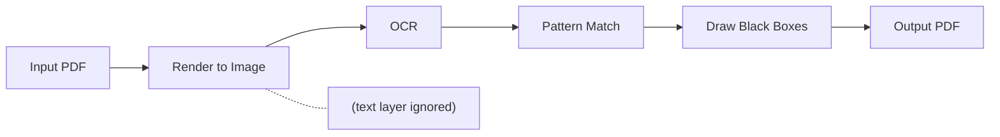

# bleachpdf

PII redaction tool for PDF documents. Renders each page to an image, OCRs it, matches against PEG grammar patterns, draws black boxes over matches, and reassembles into a new PDF.

## Why This Approach?

**Every PDF is treated as a scanned document.** We never extract or trust the PDF's text layer. Instead, we render each page to a high-resolution image and OCR it from scratch. This means:

- Scanned documents, faxed pages, and image-based PDFs work identically to native digital PDFs
- Text hidden behind images or in unusual encodings gets caught
- The output is always a clean image-based PDF with no hidden text layer to leak

Most redaction tools either rely on the PDF text layer (failing on scans) or use ML/NLP models to detect generic PII patterns (missing unusual formats, producing false positives). This tool takes a different approach: **you define exact patterns using PEG grammars**. Ideal when you know the specific values to redact—your SSN, specific account numbers, known addresses.

| Approach | Best For |
|----------|----------|
| ML/NLP (Presidio, etc.) | Unknown documents, generic PII detection |
| Text-layer extraction | Native digital PDFs only |
| **Image + OCR (this tool)** | Known values, any PDF type, precise control |

## How It Works



1. **Render**: Each page is rasterized at configurable DPI (default 300) using PyMuPDF. The PDF's text layer is ignored.
2. **OCR**: Tesseract extracts words with bounding box coordinates from the rendered image.
3. **Normalize**: Text is stripped of non-alphanumeric characters (e.g., `123-45-6789` → `123456789`).
4. **Match**: PEG grammars match against the normalized text stream.
5. **Redact**: Black rectangles are drawn over matched words on the image.
6. **Reassemble**: Redacted images are combined into a new PDF.
7. **Verify**: The output is re-scanned to confirm no patterns remain (can be disabled with `--no-verify`).

The output PDF contains only images -- no searchable text layer, no hidden metadata from the original.

## Requirements

- Python 3.9+
- [Tesseract OCR](https://github.com/tesseract-ocr/tesseract) installed on your system

## Installation

```bash
# Install Tesseract (Ubuntu/Debian)
sudo apt install tesseract-ocr

# Install Tesseract (macOS)
brew install tesseract

# Install bleachpdf
pip install bleachpdf

# Or install from source
pip install -e .
```

## Configuration

Create a config file with your PII patterns. The tool searches for config in this order:

1. `-c/--config` command line argument
2. `$BLEACHPDF_CONFIG` environment variable
3. `./pii.yaml` (current directory)
4. `~/.config/bleachpdf/pii.yaml` (user config)
5. `/etc/xdg/bleachpdf/pii.yaml` (system config)

Copy the example config to get started:

```bash
cp pii.example.yaml pii.yaml
```

### Pattern Examples

Each pattern is a [PEG grammar](https://github.com/erikrose/parsimonious) with `match` as the entry point:

```yaml
patterns:
  # Literal match - exact string (after normalization)
  - 'match = "123456789"'

  # SSN pattern - 9 consecutive digits
  - |
    match = d d d d d d d d d
    d = ~"[0-9]"

  # Account number with prefix
  - |
    match = "ACCT" d d d d d d
    d = ~"[0-9]"

  # Case-insensitive match using (?i) flag
  - 'match = ~"(?i)johndoe"'

  # Address with optional suffix (case-insensitive)
  - |
    match = ~"(?i)123mainst(reet)?"

  # Partial match - last 4 digits of known number
  - 'match = "1234"'
```

### Text Normalization

Before matching, all text is normalized by removing non-alphanumeric characters:
- `123-45-6789` becomes `123456789`
- `John Doe` becomes `JohnDoe`
- `ACCT#12345` becomes `ACCT12345`

Your patterns should match against the normalized form.

## Usage

```bash
# Single file (output to output/document.pdf)
bleachpdf document.pdf

# Single file with specific output
bleachpdf document.pdf -o redacted.pdf

# Single file to output directory
bleachpdf document.pdf -o out/

# Directory (recursive, preserves structure)
bleachpdf data/ -o output/

# Glob pattern (quote to prevent shell expansion)
bleachpdf "docs/**/*.pdf" -o output/

# Specify config file
bleachpdf -c mypatterns.yaml document.pdf

# Quiet mode
bleachpdf -q document.pdf

# Verbose mode (shows processing progress)
bleachpdf -v document.pdf
```

### Options

| Option | Description |
|--------|-------------|
| `-o, --output` | Output file or directory (default: `output/`) |
| `-c, --config` | Path to config file |
| `-d, --dpi` | Resolution for rendering and output (default: 300) |
| `--no-verify` | Skip re-scanning output to verify redaction (faster but less safe) |
| `-q, --quiet` | Suppress output |
| `-v, --verbose` | Show processing progress |
| `-h, --help` | Show help |

### Output Behavior

| Inputs | `-o` value | Result |
|--------|------------|--------|
| Single file | (none) | `output/<filename>.pdf` |
| Single file | `redacted.pdf` | `redacted.pdf` |
| Single file | `out/` | `out/<filename>.pdf` |
| Multiple files | (none) | `output/` preserving structure |
| Multiple files | `out/` | `out/` preserving structure |
| Multiple files | `single.pdf` | **Error** |

### Verification

By default, bleachpdf re-scans each output file after redaction to verify that no patterns are still detectable. This runs the same OCR + pattern matching pipeline on the redacted output. If any matches are found, the tool exits with code 1 and reports which files failed.

This catches edge cases where redaction boxes don't fully cover the text. Use `--no-verify` to skip this step if you need faster processing and accept the risk.

## Dependencies

- **pytesseract**: Python wrapper for Tesseract OCR
- **Pillow**: Image processing
- **PyMuPDF**: PDF rendering
- **reportlab**: PDF generation
- **PyYAML**: Config file parsing
- **parsimonious**: PEG grammar parsing
- **platformdirs**: Cross-platform config directory support
